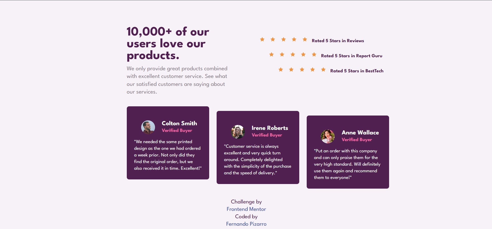

# Frontend Mentor - Social Proof Section

This is a solution to the [Social Proof Section challenge on Frontend Mentor](https://www.frontendmentor.io/challenges/social-proof-section-6e0qTv_bA).

## Overview

A testimonial layout using Flexbox with responsive design for mobile and desktop.

### Screenshot

### Links

- [Solution](https://www.frontendmentor.io/solutions/responsive-testimonial-layout-using-flexbox-and-media-queries-9O007qSmSc)
- [Live Site](https://fernandopizarrodw.github.io/Frontend-Mentor-Social-proof-section/)

## Built With

- HTML5
- CSS3
- Flexbox
- Mobile-first workflow

## What I Learned

I practiced arranging cards in a "staircase" layout using Flexbox and media queries.

## Author

- GitHub - [@fernandopizarrodw](https://github.com/fernandopizarrodw)
- Frontend Mentor - [@fernandopizarrodw](https://www.frontendmentor.io/profile/fernandopizarrodw)
